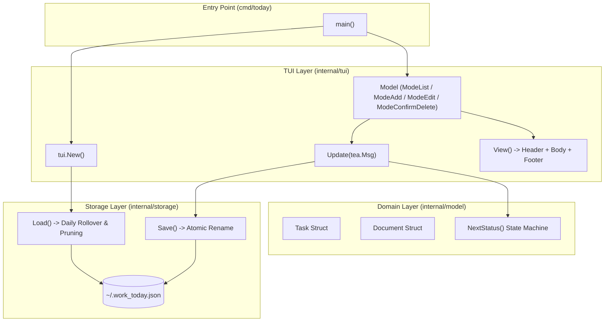

# Project Analysis: `work-today` (TaskWarrior)

> **Context**: This document provides an exhaustive technical and architectural breakdown of the `work-today` repository within `/home/alireza/Projects/TaskWarrior`. It serves as the primary system specification and reference artifact for future development prompts.

---

## 1. Project Overview & Philosophy

`work-today` (binary name: `today`) is an opinionated, minimalist, keyboard-driven terminal task manager designed for single-day focus.

### Core Principles
- **Day-focused Scope**: Prioritizes today's agenda rather than endless backlog accumulation.
- **Zero Configuration**: Starts out of the box with zero setup, storing data locally in JSON format (`~/.work_today.json`).
- **Automatic Rollover**: When the local calendar date advances, completed tasks from previous days are automatically pruned, while pending and in-progress tasks roll forward seamlessly into the new day.
- **Atomic Persistence**: File operations use temporary-file sync and atomic rename patterns to eliminate corrupt state on crashes.
- **Keyboard-First Interface**: Built on the Charm terminal ecosystem (`bubbletea`, `bubbles`, `lipgloss`) for snappy navigation and feedback.

---

## 2. Technology Stack & Dependencies

| Component | Library / Package | Version | Purpose |
| :--- | :--- | :--- | :--- |
| **Language** | Go | `1.27.1` | Core language runtime |
| **TUI Framework** | `github.com/charmbracelet/bubbletea` | `v1.3.10` | The Elm Architecture (TEA) for terminal UI |
| **Styling & Layout** | `github.com/charmbracelet/lipgloss` | `v1.1.0` | ANSI color palettes, styling, box models |
| **UI Components** | `github.com/charmbracelet/bubbles` | `v1.0.0` | Text input (`textinput`), key binding definitions (`key`) |
| **Identifier Gen** | `github.com/google/uuid` | `v1.6.0` | Cryptographically unique IDs (`UUIDv4`) for tasks |

---

## 3. Repository & Directory Structure

```text
/home/alireza/Projects/TaskWarrior/
└── work-today/
    ├── cmd/
    │   └── today/
    │       └── main.go              # CLI entry point (dispatches to CLI subcommands or TUI runner)
    ├── internal/
    │   ├── cli/
    │   │   ├── cli.go               # Headless CLI subcommands (add, list, status, done, export, help)
    │   │   └── cli_test.go          # Unit tests for CLI subcommands
    │   ├── model/
    │   │   ├── task.go              # Task & Document types, status & priority cycles, export markdown
    │   │   └── task_test.go         # Model and export unit tests
    │   ├── storage/
    │   │   ├── json.go              # JSON persistence, XDG path resolution, atomic write, daily rollover
    │   │   └── json_test.go         # Round-trip, XDG, and rollover behavior tests
    │   └── tui/
    │       ├── model.go             # Bubble Tea Model, event handlers, undo/redo stack, keybindings
    │       ├── model_test.go        # Interaction tests for reordering, priority cycling, undo/redo
    │       └── views.go             # Lip Gloss rendering components (header, list, dialogs, footer)
    ├── docs/
    │   └── project_analysis.md      # Project specification & architectural reference
    ├── go.mod                       # Go module definitions
    ├── go.sum                       # Checksums for Go dependencies
    └── .gitignore                   # Ignores build binaries and temporary files
```

---

## 4. Architectural Analysis & Component Breakdown



### 4.1. Domain Model (`internal/model/task.go`)

The domain layer encapsulates task state and status transition rules.

```go
type Task struct {
    ID        string    `json:"id"`
    Title     string    `json:"title"`
    Status    string    `json:"status"`
    Priority  string    `json:"priority,omitempty"`
    CreatedAt time.Time `json:"created_at"`
    UpdatedAt time.Time `json:"updated_at"`
}

type Document struct {
    Date  string `json:"date"` // Format: YYYY-MM-DD
    Tasks []Task `json:"tasks"`
}
```

#### Status State Machine
Status cycle order: `todo` → `in_progress` → `done` → `todo`

| Status Key | UI Glyph | UI Label | Styling | Next Status |
| :--- | :---: | :---: | :--- | :--- |
| `todo` | `[ ]` | `TODO` | Default foreground | `in_progress` |
| `in_progress` | `[~]` | `DOING` | Bold Warm Yellow/Orange (`Color("214")`) | `done` |
| `done` | `[x]` | `DONE` | Green (`Color("114")`), Strikethrough text | `todo` |

- `NextStatus(current string) string`: Computes next cyclic state or defaults to `todo` if unrecognized.
- `StatusLabel(status string)` & `StatusGlyph(status string)`: Standardized label and bracket representations.

#### Priority State Machine
Priority cycle order: `none` (`""`) → `high` → `medium` → `low` → `none`

| Priority Key | UI Badge | Styling | Next Priority |
| :--- | :---: | :--- | :--- |
| `""` (None) | *(hidden)* | Default foreground | `high` |
| `high` | `[HIGH]` | Bold Red (`Color("196")`) | `medium` |
| `medium` | `[MED]` | Warm Amber (`Color("214")`) | `low` |
| `low` | `[LOW]` | Soft Blue (`Color("75")`) | `""` |

- `NextPriority(current string) string`: Cycles priority levels.
- `PriorityLabel(priority string) string`: Formats concise badge strings.

---

### 4.2. Storage & Rollover Engine (`internal/storage/json.go`)

Data is persisted following the **XDG Base Directory Specification** with seamless backwards-compatible fallback to legacy locations.

#### Path Resolution Priority:
1. **`WORK_TODAY_PATH` Environment Variable**: Explicit path override if non-empty.
2. **Existing XDG File**: Checks `$XDG_DATA_HOME/work-today/tasks.json` (or `~/.local/share/work-today/tasks.json` if unset). Also recognizes existing `work-today/.work_today.json`.
3. **Legacy Fallback**: If an existing `$HOME/.work_today.json` is found and no XDG file exists, the legacy file is preserved and used.
4. **Default XDG Path**: If clean/uninitialized, defaults to `$XDG_DATA_HOME/work-today/tasks.json` (or `~/.local/share/work-today/tasks.json`).
5. **Local Relative Fallback**: Falls back to `./.work_today.json` if user home directory resolution fails.

#### Key Mechanisms:
1. **Thread-Safe Access**: All storage operations are protected with an internal mutex (`mu sync.Mutex`).
2. **Directory Creation**: `os.MkdirAll` ensures parent directories (such as `~/.local/share/work-today`) exist prior to saving.
3. **Atomic Write-On-Save (`saveUnlocked`)**:
   - Formats JSON with 2-space indentation.
   - Writes to a temporary file (`.work_today.*.tmp`) in the destination directory.
   - Calls `tmp.Sync()` before closing to flush filesystem buffers.
   - Performs `os.Rename(tmpName, path)` ensuring atomic swap on POSIX filesystems.
   - Cleans up stale temp files in a deferred error-recovery block.
4. **Rollover Algorithm (`Load`)**:
   ```mermaid
   sequenceDiagram
       participant App as TUI App
       participant Storage as storage.Load()
       participant File as ~/.work_today.json

       App->>Storage: Load()
       alt File does not exist
           Storage-->>App: New Document(Date: Today, Tasks: [])
       else File exists
           Storage->>File: Read and Parse JSON
           alt doc.Date == Today
               Storage-->>App: Return Document as-is
           else doc.Date != Today (New Day Detected)
               Storage->>Storage: Filter out StatusDone tasks
               Storage->>Storage: Retain StatusTodo & StatusInProgress
               Storage->>Storage: Update doc.Date = Today
               Storage->>File: Save updated document atomically
               Storage-->>App: Return Rolled-Over Document
           end
       end
   ```

---

### 4.3. Terminal User Interface (`internal/tui/`)

The TUI leverages Bubble Tea's Model-Update-View architecture.

#### Interaction Modes (`Mode` Enum):
- `ModeList`: Default browsing mode. Keybindings navigate the task list, trigger status toggles, or switch to modal sub-modes.
- `ModeAdd`: Inline input prompt for creating a task with a UUIDv4 identifier and current timestamp.
- `ModeEdit`: Inline input prompt pre-populated with selected task's title.
- `ModeConfirmDelete`: Danger prompt asking `Delete "<title>"? (y/n)`.

#### Keybindings Map (`defaultKeys`):
| Key(s) | Action | Scope |
| :--- | :--- | :--- |
| `↑` / `k` | Move cursor up | `ModeList` |
| `↓` / `j` | Move cursor down | `ModeList` |
| `K` / `Shift+Up` | Move selected task up (reorder) | `ModeList` |
| `J` / `Shift+Down` | Move selected task down (reorder) | `ModeList` |
| `p` | Cycle task priority (`None` → `HIGH` → `MED` → `LOW`) | `ModeList` |
| `u` | Undo last action (stack depth up to 50) | `ModeList` |
| `U` / `Ctrl+R` | Redo last undone action | `ModeList` |
| `c` / `y` | Copy formatted Markdown checklist to clipboard | `ModeList` |
| `Enter` / `Space` | Cycle task status (`todo` → `doing` → `done`) | `ModeList` |
| `a` | Enter Add Task mode | `ModeList` |
| `e` | Enter Edit Task mode | `ModeList` |
| `d` | Enter Delete Confirmation mode | `ModeList` |
| `?` | Toggle shortcut helper status message | `ModeList` |
| `q` / `Ctrl+C` | Gracefully quit application | `ModeList` |
| `Enter` | Submit title input (Add/Edit) | `ModeAdd`, `ModeEdit` |
| `Esc` | Cancel operation, return to list | `ModeAdd`, `ModeEdit`, `ModeConfirmDelete` |
| `y` | Confirm task deletion | `ModeConfirmDelete` |
| `n` | Reject task deletion | `ModeConfirmDelete` |

#### Visual Layout Structure (`views.go`):
1. **Header**:
   - Title: `work today` in cyan/blue accent (`Color("39")`).
   - Metadata: Formatted date (`Mon, 02 Jan 2006`), completion progress counter (`X/Y done`), and data file path.
   - Divider: Border line below header.
2. **Body**:
   - Empty state message when task list is empty.
   - Rendered task rows: Cursor (`› `), glyph (`[ ]`, `[~]`, `[x]`), status badge (`TODO`, `DOING`, `DONE`), priority badge (`[HIGH]`, `[MED]`, `[LOW]`), and title text (with strikethrough for completed tasks).
   - Mode-specific overlay widgets (rounded border text input box for Add/Edit; red warning banner for deletion).
3. **Footer**:
   - Shortcut legend dynamic to current mode.
   - Status message area showing transient notices (`"task added"`, `"saved"`, `"action undone"`, `"copied markdown to clipboard"`).

---

### 4.4. Headless CLI Subcommands (`internal/cli/cli.go`)

When run with arguments (`today <command> [args]`), non-interactive subcommands execute directly without initializing the TUI:

| Subcommand | Syntax / Flags | Description |
| :--- | :--- | :--- |
| `add` / `+` | `today add [-p PRIORITY] <title>` | Appends a task to today's list with optional priority (`high`, `med`, `low`). |
| `list` / `ls` | `today list` | Prints today's tasks with 1-based indices, checkboxes, and priority tags to stdout. |
| `status` | `today status` | Prints a single-line summary (e.g., `2/5 done` or `All done! (5/5)`) for tmux / status bars. |
| `done` | `today done <number>` | Checks off a task by its 1-based list index. |
| `export` | `today export` | Outputs today's checklist formatted in standard GitHub Markdown. |
| `help` | `today help` | Displays CLI and TUI keyboard usage help. |

---

## 5. Testing & Verification

Comprehensive unit tests across all packages:
- `internal/cli/cli_test.go`:
  - `TestCliAddAndList`: Tests CLI add with and without priority flags, and list formatting.
  - `TestCliStatusAndDone`: Tests status counter output and checking off tasks by index.
  - `TestCliExport`: Tests markdown export output.
  - `TestCliErrors`: Tests error handling for empty titles, invalid/out-of-range task numbers, and unknown commands.
- `internal/model/task_test.go`:
  - `TestNextStatusCycles`: Tests all transitions in `NextStatus`.
  - `TestNextPriorityCycles`: Tests full cycle from none through high, medium, low, back to none.
  - `TestPriorityLabel`: Tests string label representations for each priority.
  - `TestParsePriority`: Tests CLI flag normalization (e.g. `H`, `high`, `1`, `med`, `low`).
  - `TestExportMarkdown`: Tests Markdown checklist generation with done/progress/todo items and priority tags.
- `internal/storage/json_test.go`:
  - `TestPathResolution`: Validates clean XDG path resolution, custom `$XDG_DATA_HOME`, relative path rejection, legacy `$HOME/.work_today.json` fallback, XDG precedence over legacy, and `$WORK_TODAY_PATH` override.
  - `TestSaveAndLoadRoundTrip`: Validates writing to isolated `t.TempDir()`, verify path correctness (`.local/share/work-today/tasks.json`), directory creation, and unmarshaled data fidelity.
  - `TestSaveAndLoadLegacyFallback`: Validates reading from and writing back to pre-existing legacy file without creating unwanted XDG files.
  - `TestLoadCarriesForwardOpenTasks`: Validates yesterday's date triggers rollover, completed tasks are purged, and unfinished tasks are preserved with today's date stamped.
  - `TestLoadMissingFile`: Validates default state creation on first run.
- `internal/tui/model_test.go`:
  - `TestReorderTasks`: Simulates `J` and `K` keystrokes, verifies in-memory swap and atomic disk persistence, and tests boundary conditions.
  - `TestPriorityCycling`: Simulates `p` keystroke cycling through all priority states and saving.
  - `TestViewsRendering`: Ensures view layout renders without runtime formatting panics.
  - `TestUndoAndRedo`: Simulates deleting a task, undoing deletion (`u`), redoing deletion (`U`), toggling status, and undoing status changes.

---

## 6. Current Strengths & Identified Limitations

### Strengths
- **Clean Separation of Concerns**: Storage, UI, CLI, and domain models are decoupled and independently testable.
- **Robust I/O**: Atomic save prevents file corruption during sudden terminal disconnects; auto-creates parent directories.
- **XDG-Compliant with Legacy Fallback**: Adheres to modern Linux desktop standards while preserving existing user data without migration friction.
- **Task Reordering & Prioritization**: Instant keyboard control (`J`/`K` to reorder, `p` to prioritize) with colored badges.
- **Multi-Level Undo & Redo**: Safe task management with snapshot history stack (`u` to undo, `U`/`Ctrl+R` to redo).
- **Clipboard & Standup Export**: Fast clipboard copying (`c`/`y`) and terminal Markdown export for standups.
- **Headless Shell Integration**: `today add`, `today list`, `today status`, and `today done` work in scripts, terminal aliases, and status bars (tmux/starship).
- **Minimalist UX**: Immediate startup, sub-millisecond responsiveness, zero latency.

### Identified Limitations & Enhancement Opportunities
1. **Task Metadata**:
   - Does not currently support long descriptions, subtasks, tags, or due times/reminders.
2. **History Archive**:
   - Rollover clears yesterday's completed tasks without archiving them to a separate daily history file.

---

## 7. Reference Guide for Future Prompts

When writing new features, follow these conventions:
1. **Model Changes (`internal/model`)**:
   - If adding fields to `Task`, maintain backward compatibility by ensuring JSON omitempty or sensible defaults on deserialization.
2. **Storage Changes (`internal/storage`)**:
   - Always retain the atomic save pattern (`os.CreateTemp` + `tmp.Sync()` + `os.Rename`).
   - If changing document format, implement schema migration during `storage.Load()`.
3. **UI Additions (`internal/tui`)**:
   - Maintain the standard Bubble Tea update loop pattern.
   - Keep styling in `views.go` aligned with Lip Gloss palettes (`colorAccent`, `colorMuted`, etc.).
   - Ensure new keybindings are registered in `keyMap` and displayed in the footer help bar.
